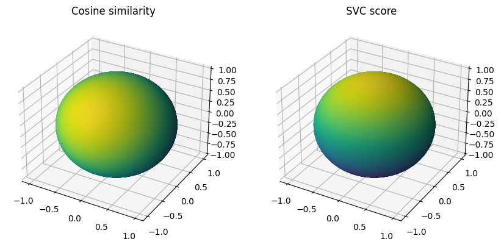

# Comparing k-nearest neighbors and SVM for retrieval

I was intrigued by this [tweet](https://twitter.com/karpathy/status/1647025230546886658?s=20) from Andrej Karpathy. Imagine that, given a query vector, we want to retrieve relevant results from a corpus of vectors (typically embeddings obtained through a neural network). Andrej claims that training a query-specific SVM is more effective than selecting the N vectors most similar to the query vector (e.g. with cosine similarity). For him, it works "because SVM ranking considers the unique aspects of your query w.r.t. data."

So I tried to come up with the simplest illustration in low dimension to wrap my head around this...

Let's say that:
- Earth is the unit sphere
- the corpus is made of a very large number of vectors on the equator and only one in Tokyo
- the query vector is located in Milano

With a k-nearest neighbors search based on cosine similarity, the first result will probably be a vector on the equator directly south of the Milano, somewhere in Gabon. But with a SVM, Tokyo will be picked first it shares the feature that sets the query vector apart from the corpus of vectors: being in the northern hemisphere. It would be actually be the North Pole (and not another place in Italy) that could get the highest score!

